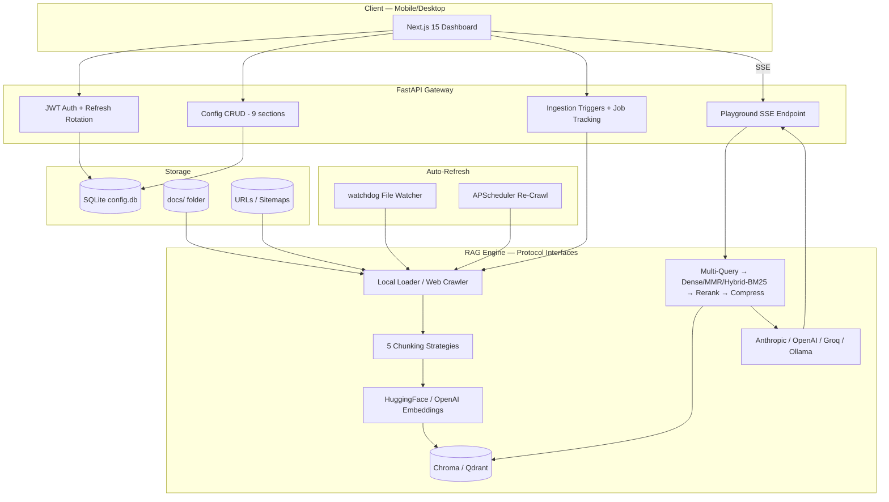

# 🚀 RAG System Builder

**A production-style, self-hosted Retrieval-Augmented Generation platform — built from scratch, end to end.**

Drop files in a folder or point it at a website, tune every layer of the retrieval pipeline from a polished web dashboard, and chat with your knowledge base through real-time streaming answers backed by precise source citations.


---

## 💡 Why This Project Stands Out

This isn't a LangChain wrapper. **Every stage of the RAG pipeline is implemented by hand** — chunking strategies, an Okapi BM25 index, Maximal Marginal Relevance, multi-query expansion, contextual compression, SSE streaming — behind clean provider interfaces, so the internals are fully visible, testable, and swappable.

- 🧩 **Interface-driven architecture** — embeddings, vector stores, LLMs, and document loaders each sit behind a Python `Protocol`. No provider-specific call ever leaks into the route layer; swapping Chroma → Qdrant or Anthropic → Ollama is a config change, not a refactor.
- 🪂 **Graceful degradation everywhere** — every heavy dependency (sentence-transformers, Playwright, watchdog, APScheduler, trafilatura) is lazy-loaded and optional. The app always boots; missing capabilities log a warning and fall back instead of crashing.
- 🔬 **Advanced retrieval built from first principles** — hand-rolled BM25 scoring, MMR diversification, cross-encoder reranking, LLM-powered query expansion and per-chunk compression.
- 🔁 **Self-updating knowledge base** — a debounced filesystem watcher and a scheduled incremental web re-crawler keep the index fresh with zero manual work, re-embedding only content whose hash actually changed.
- ✅ **66 backend tests** across 7 development phases, covering auth flows, config round-trips, ingestion, crawling, and every retrieval stage.

---

## ✨ Feature Tour

### 📁 Unified Ingestion Pipeline
One shared `load → chunk → embed → store` pipeline consumes **both local files and web pages** through a common `ParsedDocument` shape:

- **Local files**: PDF, Word (`.docx`), Markdown, HTML, CSV, and plain text — recursively scanned with glob-based exclude patterns, file-size limits, and content hashing.
- **Web crawling** (three modes): single-URL fetch, recursive **same-domain crawling** with depth/page limits, or full **`sitemap.xml` ingestion**.
- **Boilerplate-free extraction**: `trafilatura` strips navigation, ads, and chrome from scraped pages (critical for RAG quality on doc sites), with custom CSS `strip_selectors` and a BeautifulSoup fallback.
- **Polite by default**: `robots.txt` compliance, configurable concurrency and timeouts, optional JS rendering via `crawl4ai`/Playwright.
- **Content-hash deduplication**: the same page reached through two link paths is embedded once; unchanged pages are skipped on re-crawl.
- **Live job tracking**: every ingestion run is a persisted `IndexJob` with real-time progress (files processed, chunks created, errors) surfaced in the dashboard.

### ✂️ Five Chunking Strategies
`recursive` (separator hierarchy: paragraph → line → sentence → space), `token` (approximate token windows), `markdown` (heading-aware splitting), `semantic` (sentence-boundary grouping), and `fixed` — all with configurable size, overlap, and minimum chunk thresholds.

### 🔎 Multi-Stage Retrieval Engine
The retriever composes up to **five stages** per query, each toggleable from the UI:

1. **Multi-query expansion** — the LLM rewrites your question into up to 8 variants attacking it from different angles; results are unioned by chunk ID for higher recall.
2. **First-stage search** — `similarity` (dense nearest-neighbour), `mmr` (Maximal Marginal Relevance balancing relevance vs. diversity), or `hybrid` dense + lexical blending with a tunable α. Hybrid offers two lexical scorers: fast **token-overlap** re-scoring of the dense pool, or a **corpus-wide Okapi BM25 index built in-process** so keyword-only matches the dense search missed still surface.
3. **Score-threshold filtering** — drop weak candidates before they reach the LLM.
4. **Cross-encoder reranking** — a BGE reranker reorders candidates for precision; if the model can't load, the first-stage order is kept.
5. **Contextual compression** — the LLM extracts only the query-relevant sentences from each final chunk (LangChain's `LLMChainExtractor`, reimplemented), shrinking prompts and sharpening answers.

### 💬 Streaming Playground with Citations
- **Server-Sent Events** stream: `source` events fire *before* generation starts (instant citation display), then per-token `token` events, then a final `done` payload — with structured `error` events on failure.
- Interactive **citation cards** show the matched text snippet, similarity score, and source (file path or clickable URL).
- **Context-window budgeting**: retrieved chunks are packed under a token-derived character budget so oversized chunk sets can never blow past the model's context window.

### 🔌 Swappable Providers
| Layer | Implemented | Notes |
|---|---|---|
| **LLM** | Anthropic (default) · OpenAI · Groq · Ollama | Streaming + non-streaming for all four; Ollama runs fully local with no API key |
| **Embeddings** | HuggingFace sentence-transformers (local, default) · OpenAI | Config slots ready for Cohere, Voyage, Ollama |
| **Vector store** | ChromaDB (zero-setup dev default) · Qdrant (production) | Config slots ready for pgvector, Milvus; tunable HNSW params & distance metrics |

### 🔄 Auto-Refresh Workers
- **File watcher** (`watchdog`): filesystem events on the docs folder trigger incremental re-indexing, with a debounce window so an editor save emitting five events causes one re-index, not five.
- **Scheduled re-crawl** (`APScheduler`): periodic web-source refresh that compares stored content hashes and **re-embeds only changed pages**.
- Both wire into the FastAPI lifespan, restart cleanly on config changes, and no-op safely when disabled or when their library isn't installed.

### 🔐 Security
- **JWT authentication** with short-lived access tokens and **rotating refresh tokens in HTTP-only cookies** (revoked server-side on logout).
- **bcrypt** password hashing; admin user seeded from environment config.
- **Credential masking**: stored API keys are returned as `******` and a masked round-trip can never overwrite a real key.
- **Contract-shaped error envelope** — every error, from validation to auth, returns one consistent JSON shape.

### 📱 Mobile-First Dashboard (8 pages)
Next.js 15 App Router + Tailwind + shadcn/ui: collapsible sidebar on desktop, compact bottom navigation at 375 px. Pages: **Overview**, **Sources**, **Web Sources** (with a live extraction-preview tester), **Pipeline** (job history), **Vector Store**, **Retrieval**, **Playground**, **Settings** — each with optimistic forms, skeleton loading states, and a floating save bar.

---

## 🛠️ Technology Stack

| | |
|---|---|
| **Backend** | FastAPI (async Python 3.11+), SQLModel + SQLite, Pydantic v2 config schemas |
| **RAG engine** | sentence-transformers, Qdrant / ChromaDB, hand-rolled BM25 + MMR, cross-encoder reranking |
| **Ingestion** | trafilatura, BeautifulSoup, httpx, optional crawl4ai/Playwright, pypdf, python-docx |
| **Workers** | watchdog (file events), APScheduler (cron re-crawls) |
| **Frontend** | Next.js 15, React 19, TypeScript, TailwindCSS, shadcn/ui, SSE client |
| **Infra** | Docker & Docker Compose (3-service stack), JWT auth, bcrypt |

---

## 🏗️ System Architecture



---

## 🌐 API Surface

| Endpoint | Purpose |
|---|---|
| `POST /auth/login` · `/refresh` · `/logout` · `GET /auth/me` | JWT flow with HTTP-only cookie refresh rotation |
| `GET/PUT /settings/config` · `/settings/config/{section}` | Full or per-section config CRUD (9 validated sections) |
| `POST /sources/ingest` | Index the local docs folder (background job) |
| `POST /web-sources/ingest` · `POST /web-sources/test` | Crawl web sources / live-preview content extraction |
| `GET /pipeline/jobs` · `/pipeline/jobs/{id}` | Real-time ingestion job status & history |
| `POST /playground/query` | Full RAG query — JSON or SSE token stream with citations |

Interactive Swagger docs ship at `/docs`.

---

## 🚀 Getting Started (Docker Compose)

One command brings up the backend, the Next.js frontend, and Qdrant.

### 1. Clone the repository
```bash
git clone https://github.com/maxims12/rag-builder.git
cd rag-builder
```

### 2. Configure your environment
```bash
cp .env.example .env
```
Open `.env` and fill in:
* `ANTHROPIC_API_KEY` (or `OPENAI_API_KEY` / `GROQ_API_KEY` — or none, if you run Ollama locally).
* `ADMIN_EMAIL` / `ADMIN_PASSWORD` for the seeded admin account.

### 3. Build and launch the stack
```bash
docker compose up --build -d
```

### 4. Log in
Open 👉 **[http://localhost:3001](http://localhost:3001)** and sign in with the admin credentials you configured in `.env`.

---

## 💻 Local Development Setup

### Prerequisites
* **Python** `>=3.11` with [uv](https://github.com/astral-sh/uv)
* **Node.js** `>=18`
* **Qdrant** on port `6333` — or nothing at all: the default ChromaDB backend is embedded and needs no external service.

### 1. Run the Backend
```bash
cd backend
uv sync                      # create venv + install dependencies
cp ../.env .env
uv run uvicorn app.main:app --reload --host 0.0.0.0 --port 8000
```
Swagger docs: [http://localhost:8000/docs](http://localhost:8000/docs)

### 2. Run the Frontend
```bash
cd frontend
npm install
npm run dev
```
Open [http://localhost:3000](http://localhost:3000).

### 3. Run the Test Suite
```bash
cd backend
uv run pytest              # 66 tests across 7 phases
```

---

## 📖 User Walkthrough

### 1. Index Local Documents
1. Drop PDFs, Word docs, or Markdown files into the `docs/` folder.
2. Open the **Sources** tab — your files appear automatically.
3. Click **"Re-index local files"** and watch the job go `pending → running → done` in real time.
4. *(Optional)* Enable **watch mode** and the index updates itself on every file save.

### 2. Scrape & Index Websites
1. Open the **Web Sources** tab and add target URLs (single pages, crawl roots, or a sitemap).
2. Click **"Ingest web sources"** to launch the background crawl.
3. Use the **Test extraction** box to preview exactly how the boilerplate-stripping parser cleans any URL — before committing to a crawl.
4. *(Optional)* Enable **auto-refresh** for scheduled incremental re-crawls.

### 3. Chat in the Playground
1. Ask anything about your indexed content.
2. Watch citations appear instantly, then the answer stream in token by token.
3. Flip retrieval strategies in the **Retrieval** tab — similarity vs. MMR vs. hybrid BM25, reranking on/off, multi-query, compression — and compare answer quality live.

---

## 🧬 Configuration Reference

Every knob below is live-editable from the dashboard and persisted per user:

| Section | Options |
|---|---|
| **Sources** | Docs folder, watch mode, recursion, file-type allowlist, exclude patterns, size limits, debounce interval |
| **Web Sources** | URL list, mode (`single` / `crawl` / `sitemap`), depth, max pages, same-domain lock, JS rendering, strip selectors, robots.txt, concurrency, auto-refresh cadence |
| **Chunking** | Strategy (`recursive` / `token` / `markdown` / `semantic` / `fixed`), size, overlap, min size, sentence-boundary respect |
| **Embeddings** | Provider, model string (e.g. `BAAI/bge-small-en-v1.5`, `text-embedding-3-small`), dimensions, batch size, normalization, CPU/CUDA |
| **Vector Store** | Backend, collection name, distance metric (`cosine` / `euclidean` / `dot`), HNSW `m` / `ef_construct`, on-disk persistence |
| **Retrieval** | `top_k`, score threshold, search type (`similarity` / `mmr` / `hybrid`), MMR diversity, hybrid α + method (`token_overlap` / `bm25`), reranker model, multi-query count (1–8), contextual compression |
| **LLM** | Provider, model, temperature, max tokens, system prompt, streaming toggle |
| **Credentials** | Per-provider API keys — masked on read, never overwritten by a masked round-trip |

---

## 🧪 Quality & Testing

The backend was built in **7 test-gated phases**, each with its own suite:

| Phase | Coverage |
|---|---|
| 1 — Core | App bootstrap, health, error envelope |
| 2 — Auth | Login, refresh rotation, logout revocation, `me` |
| 3 — Config | Section CRUD, validation, credential masking round-trips |
| 4 — Ingestion | Loaders, chunkers, pipeline job tracking |
| 5 — Web | Crawl modes, extraction, dedup, robots handling |
| 6 — Retrieval | Similarity / MMR / hybrid / BM25 / rerank / multi-query / compression |
| 7 — Auto-refresh | Watcher debounce, scheduler incrementality |

**66 tests**, run with `uv run pytest`. Vector stores, embedders, and LLMs are faked at their `Protocol` seams — the same interfaces the production code uses — so retrieval logic is tested deterministically without models or network.

---

## 📂 Project Structure

```
rag-builder/
├── backend/
│   ├── app/
│   │   ├── auth/            # JWT flow, bcrypt, refresh rotation, admin seed
│   │   ├── rag/
│   │   │   ├── loader.py        # Local files → ParsedDocument
│   │   │   ├── web_loader.py    # URL / crawl / sitemap → ParsedDocument
│   │   │   ├── chunker.py       # 5 chunking strategies
│   │   │   ├── embedder.py      # Embedding provider interface
│   │   │   ├── store.py         # Chroma / Qdrant behind one Protocol
│   │   │   ├── retriever.py     # MMR, hybrid BM25, rerank, multi-query, compression
│   │   │   ├── generator.py     # 4 LLM providers, streaming, context budgeting
│   │   │   ├── pipeline.py      # load → chunk → embed → store + job tracking
│   │   │   ├── watcher.py       # Debounced filesystem auto-reindex
│   │   │   └── scheduler.py     # Incremental scheduled re-crawl
│   │   ├── routes/          # Thin route layer — no provider logic
│   │   └── config_schemas.py# 9 Pydantic config sections
│   └── tests/               # 66 tests across 7 phases
├── frontend/
│   ├── app/(dashboard)/     # 8 dashboard pages (App Router)
│   ├── components/          # shadcn/ui + responsive nav (sidebar / bottom bar)
│   └── lib/                 # Typed API client, SSE reader, token store
└── docker-compose.yml       # backend + frontend + Qdrant
```
